# Manual de Usuario Dragolandia

## Indice

- [Manual de Usuario Dragolandia](#manual-de-usuario-dragolandia)
  - [Indice](#indice)
  - [Creacion de personajes](#creacion-de-personajes)
    - [Creación de mago](#creación-de-mago)
    - [Creación de los monstruos](#creación-de-los-monstruos)
    - [Creacion de bosque](#creacion-de-bosque)
    - [Crear Dragon](#crear-dragon)
    - [Mostrar jefe del bosque](#mostrar-jefe-del-bosque)
    - [Cambiar jefe del bosque](#cambiar-jefe-del-bosque)
    - [Añadir hechizo al mago](#añadir-hechizo-al-mago)
  - [Combate](#combate)

## Creacion de personajes
Cuando el programa se inicia, aparece un menú interactivo que permite al usuario crear y gestionar personajes en el juego Dragolandia. El usuario puede crear magos, dragones, bosques, monstruos y hechizos mediante opciones numeradas. 

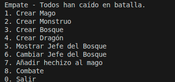
La opción de combate no realiza ninguna acción hasta que se cumplen unos requisitos mínimos:
- Al menos dos magos creados.
- Cada mago debe tener dos hechizos aprendidos del juego.
- Al menos un dragón creado.
- Al menos tres monstruos creados.
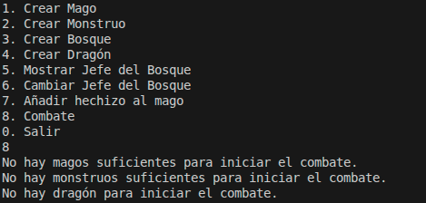

### Creación de mago
Al  seleccionar la opción `1. Crear Mago` en el menú principal. Se le solicitará al usuario que ingrese el nombre del mago y su nivel de poder. Una vez proporcionados estos datos, el mago se crea y se añade a la lista de magos disponibles en el juego. Posteriormente, se almacena en la base de datosy se muestra un mensaje de confirmación.
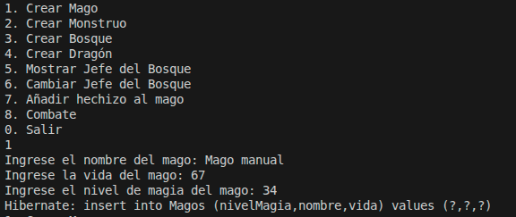

### Creación de los monstruos
Al seleccionar la opción `2. Crear Monstruo` en el menú principal, se le solicitará al usuario que ingrese el nombre del monstruo, su vida y su tipo. Posteriormente, se almacena en la base de datos y se añade a la lista de monstruos disponibles en el juego.
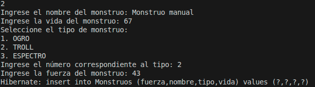

### Creacion de bosque
En el caso de que no exista ninún monstruo el programa fuerza al usuario a crear uno primero, de lo contrario la creacion de bosque daria error al no tener ningun monstruo para asignar como jefe.
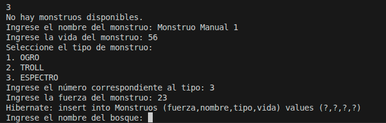

Si existe algun monstruo creado, se pasa directamente a la crea ción de bosque. Al seleccionar la opción `3. Crear Bosque` en el menú principal, se le solicitará al usuario que ingrese el nombre del bosque, su nivel de peligro y seleccione un monstruo jefe de una lista numerada de monstruos disponibles. Posteriormente, se almacena en la base de datos con su monstruo jefe.
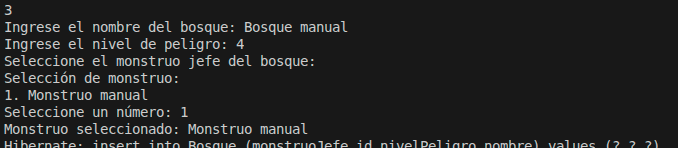
### Crear Dragon
Al seleccionar la opción `4. Crear Dragón` en el menú principal, se le solicitará al usuario que ingrese el nombre del dragón y seleccione un bosque de una lista numerada de bosques disponibles. Posteriormente, se almacena en la base de datos y se añade a la lista de dragones disponibles en el juego.
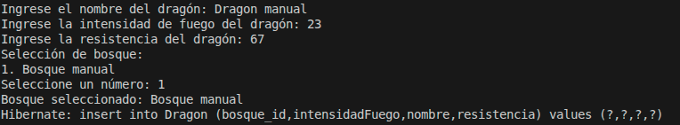

### Mostrar jefe del bosque
Al seleccionar la opción `5. Mostrar Jefe del Bosque` en el menú principal, se le solicitará al usuario que seleccione un bosque de una lista numerada de bosques disponibles. Una vez seleccionado, se muestra el nombre del monstruo jefe asociado a ese bosque.
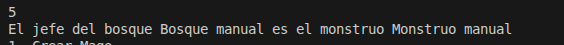

### Cambiar jefe del bosque
Al seleccionar la opción `6. Cambiar Jefe del Bosque` en el menú principal, se le solicitará al usuario que seleccione un bosque de una lista numerada de bosques disponibles. A continuación, se le pedirá que seleccione un nuevo monstruo jefe de una lista numerada de monstruos disponibles. Una vez seleccionados, se actualiza el monstruo jefe del bosque en la base de datos y se muestra un mensaje de confirmación.
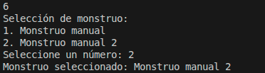

### Añadir hechizo al mago
Al seleccionar la opción `7. Añadir Hechizo al Mago` en el menú principal, se le solicitará al usuario que seleccione un mago de una lista numerada de magos disponibles. A continuación, se le pedirá dos veces que seleccione un hechizo de una lista numerada de hechizos disponibles. Una vez seleccionados, se añade el hechizo al mago en la base de datos y se muestra un mensaje de confirmación.

## Combate
Una vez realizados todos los requisitos previos, el usuario puede seleccionar la opción `8. Iniciar Combate` en el menú principal para comenzar una batalla entre los magos y los monstruos. El combate se desarrolla en rondas, cada ronda esta ejecutada de la sigueite manera:
- Los magos atacan con un hechizo de todos los disponibles en el juego, si lanza un hechizo que no sabe pierda un punto de vida.
  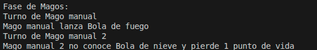
- Los monstruos vivos contraatacan, infligiendo daño a un mago aleatorio.
  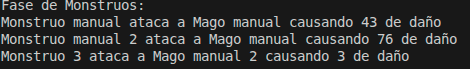
- El dragón aliado del mago exhala fuego contra un monstruo.
  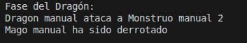
- Tras cada ronda, se muestra un reporte donde se ven que personajes siguen vivos. con su vida y cuales estan muertos.
  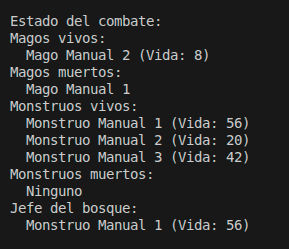
- El combate continúa hasta que todos los magos o todos los monstruos estén muertos. Al finalizar, se muestra un mensaje indicando el resultado del combate.
  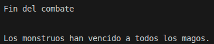