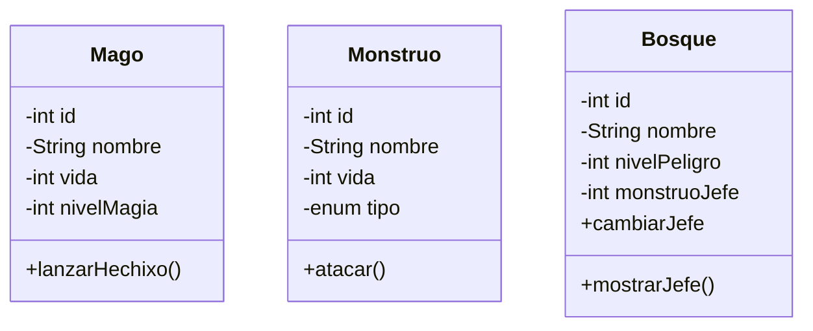

# DRAGOLANDIA
## Introdución
El proyecto **Dragolandia** está diseñado como una herramienta didáctica para practicar patrones de diseño como Model-View-Model (MVM) y el uso de frameworks como Hibernate. A través de un entorno de fantasía, los desarrolladores pueden aprender a estructurar aplicaciones, gestionar bases de datos y aplicar buenas prácticas de programación.
## Analisis

### Diagrama de clases

## Diseño 

### Diagrama entidad-relacion