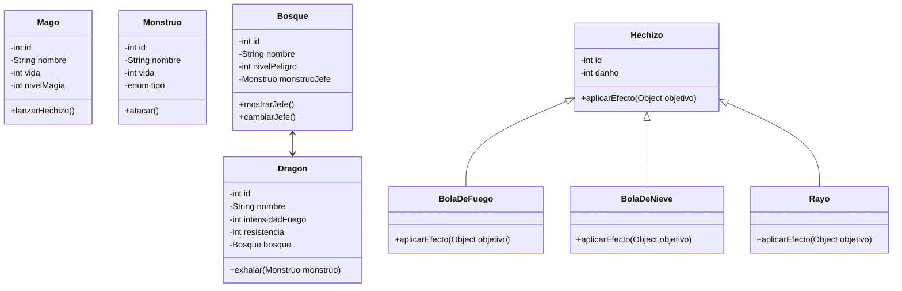
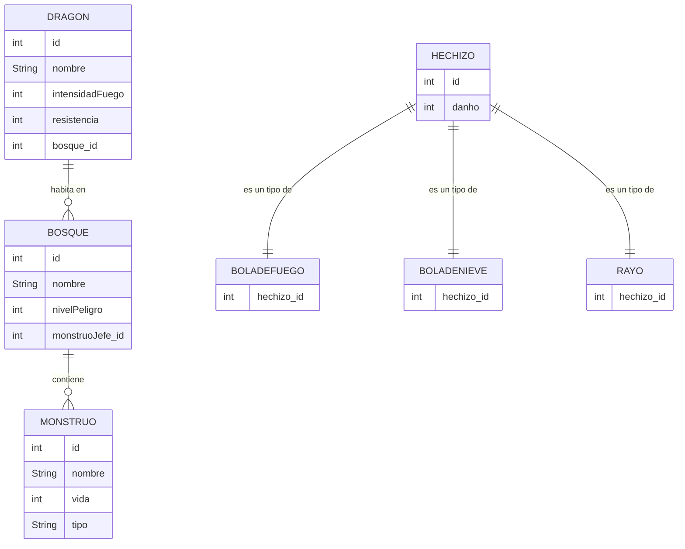

# DRAGOLANDIA
## Introducción
El proyecto **Dragolandia** está diseñado como una herramienta didáctica para practicar patrones de diseño como Model-View-Model (MVM) y el uso de Hibernate. A través del ejercicio se aprende a estructurar aplicaciones, gestionar bases de datos con Java.
## Análisis

### Diagrama de clases

## Diseño 

### Diagrama entidad-relacion

