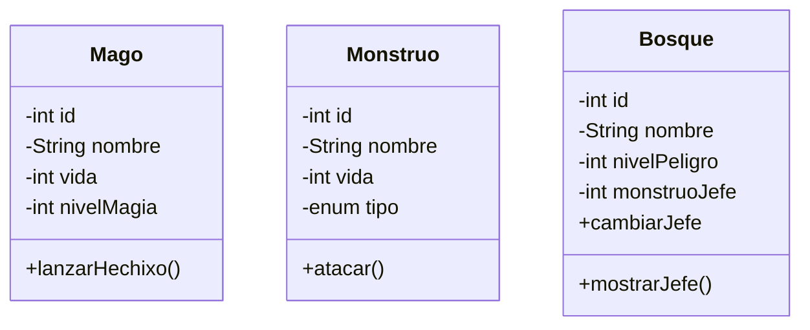

# DRAGOLANDIA
## Introdución
El proyecto **Dragolandia** pretende 
## Analisis

### Diagrama de clases

```mermaid
classDiagram
direction TB
    class Mago {
	    -int id
	    -String nombre
        -int vida
        -int nivelMagia 
	    +lanzarHechixo()
    }

    class Monstruo {
	    -int id
        -String nombre
        -int vida
        -enum tipo
	    +atacar()
    }

    class Bosque {
	    -int id
        -String nombre
        -int nivelPeligro
        -int monstruoJefe
	    +mostrarJefe()
        +cambiarJefe
    }
```

## Diseño 

### Diagrama entidad-relacion