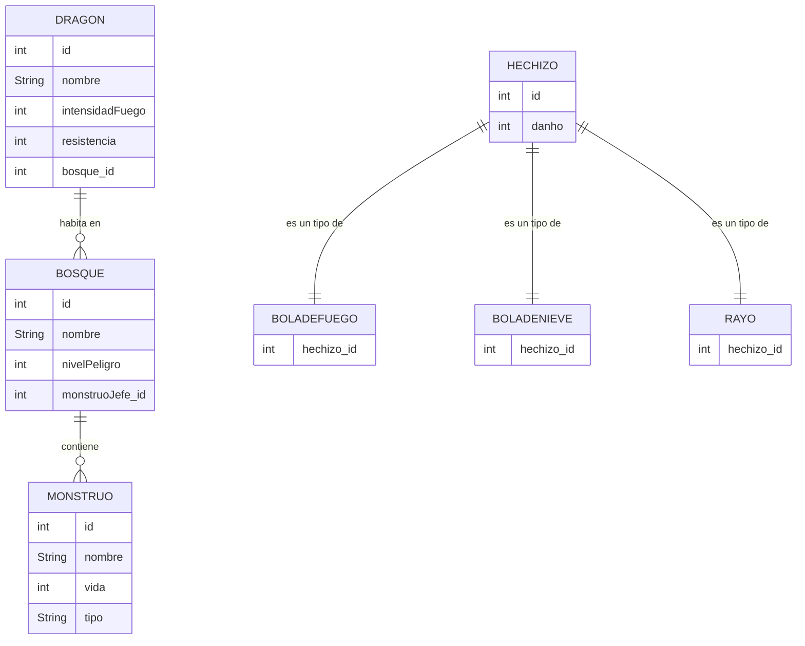

# DRAGOLANDIA
## Introducción
El proyecto **Dragolandia** está diseñado como una herramienta didáctica para practicar patrones de diseño como Model-View-Model (MVM) y el uso de Hibernate. A través del ejercicio se aprende a estructurar aplicaciones, gestionar bases de datos con Java.
## Análisis

### Diagrama de clases

## Diseño 

### Diagrama entidad-relacion

## Propuesta de mejora

Mi prouesta de mejora consiste en darle al juego un enfoque más interectivo permitiendo al usuario realizar elecciones.

El usuario comienza seleccionando un mago de entre todos los magos disponibles en el sistema. Este mago será el protagonista de la aventura y enfrentará a todos los monstruos vivos presentes en el juego.

A mayores cree el método seleccionar MonstruosAleatorios que seleccionaba una lista  aleatoria de entre los mosntruos que exisitan en el juego y que serían contra los que se enfretnaba el mago.

El combate se desarrolla en turnos alternados:
Turno del Jugador:

El usuario dispone de dos opciones de ataque:
Ataque del Dragón: Si el mago posee un dragón aliado, puede ordenarle que exhale fuego contra un monstruo seleccionado. Si no dispone de el y lo llama pierde el turno.
Lanzamiento de Hechizo: El mago puede lanzar uno de sus hechizos aprendidos contra un monstruo objetivo

Turno de los Monstruos:
Después de cada acción del jugador, los monstruos supervivientes contraatacan
Cada monstruo vivo inflige daño al mago según su atributo de fuerza

